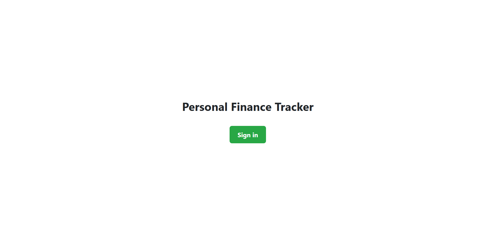
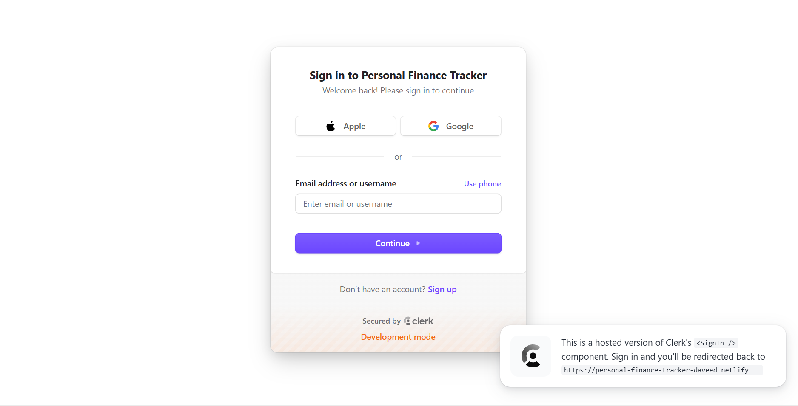
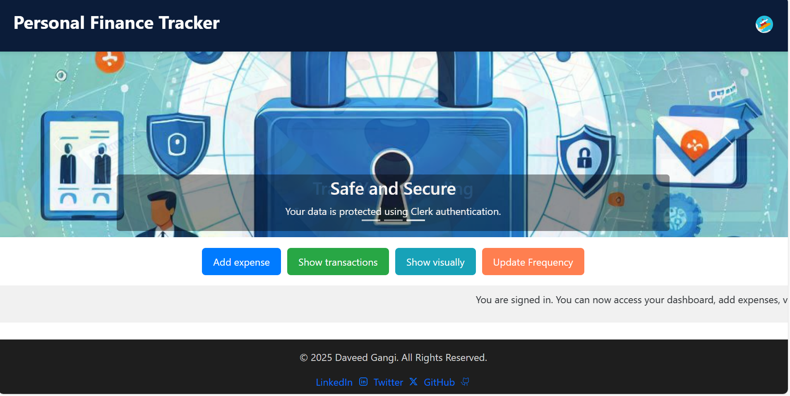
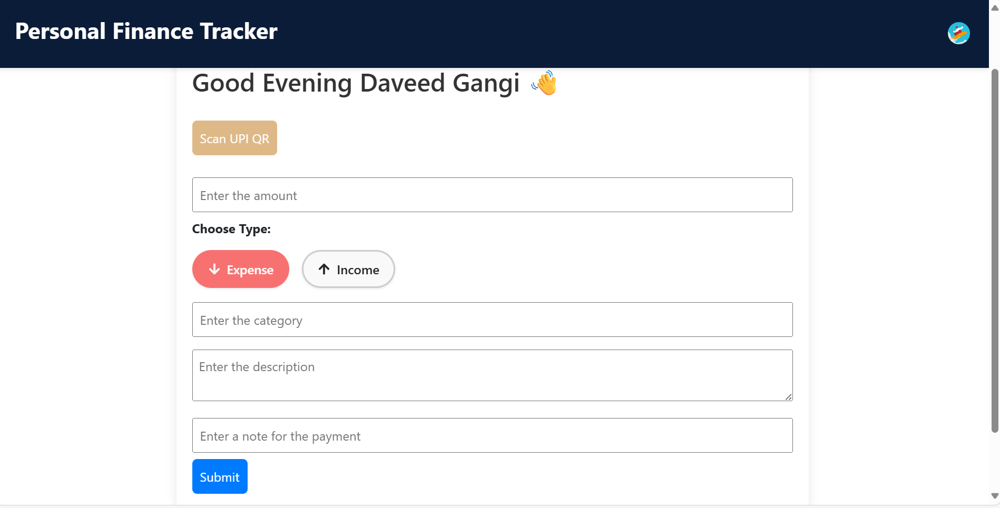
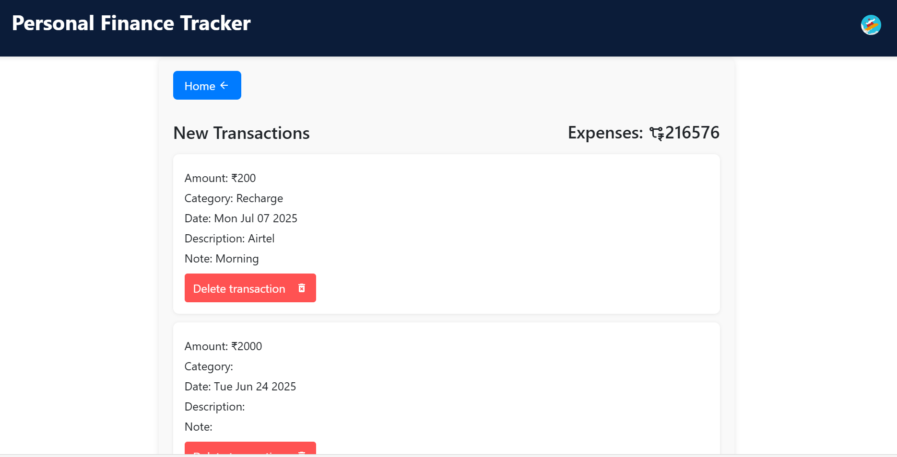
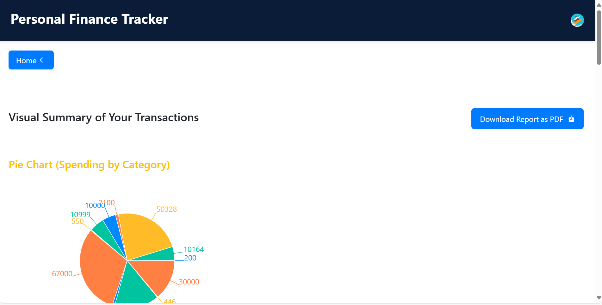
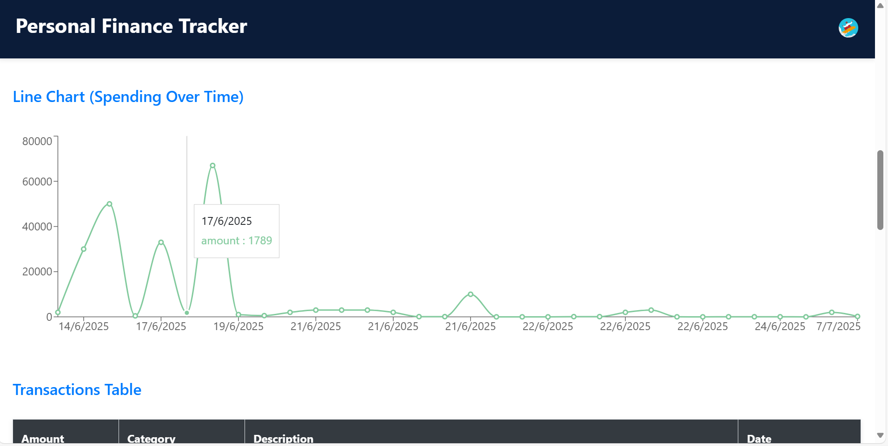
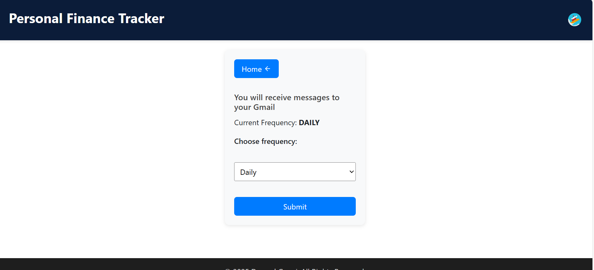
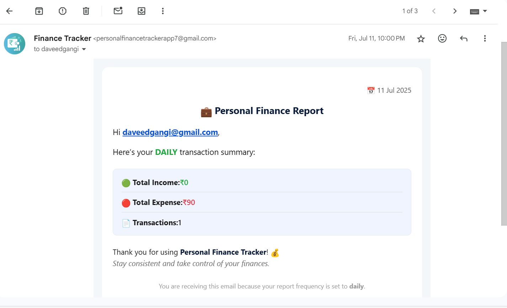
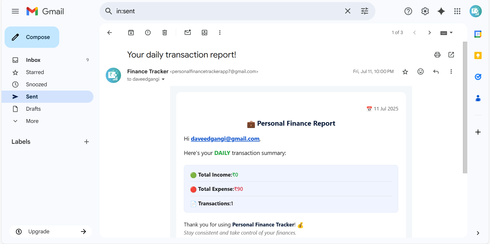

# Personal Finance Tracker 💰

A comprehensive Personal Finance Tracker application built with React, Clerk authentication, and various data visualization tools. This application helps users manage their expenses, track transactions, and gain insights into their financial habits.

## 🚀 Key Features

- **User Authentication:** Secure user authentication using Clerk.
- **Expense Tracking:** Easily add and categorize expenses.
- **Transaction History:** View a detailed history of all transactions.
- **Data Visualization:** Visualize spending patterns with pie charts, bar charts, and line charts.
- **Email Reminders:** Configure email reminder frequency for staying on top of finances.
- **QR Code Scanner:** Scan UPI QR codes for quick payment integration.
- **PDF Reports:** Generate and download PDF reports of your financial data.
- **Responsive Design:** User-friendly interface accessible on various devices.

## 🛠️ Tech Stack

- **Frontend:**
    - React
    - React Router DOM
    - React Bootstrap
    - React Icons
    - React Spinners
    - React Toastify
    - Lottie React
- **Authentication:**
    - Clerk
- **Data Visualization:**
    - Recharts
- **HTTP Client:**
    - Axios
- **PDF Generation:**
    - jsPDF
    - html2canvas
- **QR Code Scanning:**
    - html5-qrcode
- **Date/Time:**
    - moment-timezone
- **Build Tools:**
    - React Scripts
    - Tailwind CSS
    - PostCSS
    - Autoprefixer
- **Other:**
    - Bootstrap CSS

## 📦 Getting Started

Follow these steps to set up the project locally.

### Prerequisites

- Node.js (version >=16)
- npm or yarn
- Clerk account and API keys
- Backend API URL

### Installation

1.  Clone the repository:

    ```bash
    git clone <repository-url>
    cd finance
    ```

2.  Install dependencies:

    ```bash
    npm install
    # or
    yarn install
    ```

3.  Configure environment variables:

    Create a `.env` file in the root directory and add the following:

    ```
    REACT_APP_CLERK_PUBLISHABLE_KEY=<your_clerk_publishable_key>
    REACT_APP_API_URL=<your_backend_api_url>
    ```

    Replace `<your_clerk_publishable_key>` and `<your_backend_api_url>` with your actual Clerk publishable key and backend API URL.

### Running Locally

1.  Start the development server:

    ```bash
    npm start
    # or
    yarn start
    ```

2.  Open your browser and navigate to `http://localhost:3000`.

## 💻 Usage

1.  **Sign In/Sign Up:** Use the Clerk authentication to sign in or create a new account.
2.  **Add Expenses:** Navigate to the "Add Expense" page to record your expenses and income.
3.  **View Transactions:** Go to the "Show Transactions" page to see a list of all your transactions.
4.  **Visualize Data:** Use the "Show Visually" page to view charts and graphs of your spending patterns.
5.  **Update Frequency:** Adjust your email reminder frequency on the "Update Frequency" page.
6.  **Scan QR Code:** Use the QR code scanner to quickly add UPI payment details.
7.  **Download PDF:** Generate and download a PDF report of your transaction data from the "Show Visually" page.

## 📂 Project Structure

```
finance/
├── public/
│   ├── index.html
│   ├── manifest.json
│   └── images/
│       ├── Designer.jpeg
│       ├── Designer (1).jpeg
│       └── Designer (2).jpeg
├── src/
│   ├── components/
│   │   ├── addExpense/
│   │   │   ├── index.js
│   │   │   └── index.css
│   │   ├── Home/
│   │   │   ├── index.js
│   │   │   └── index.css
│   │   ├── showTransactions/
│   │   │   ├── index.js
│   │   │   └── index.css
│   │   ├── showVisually/
│   │   │   ├── index.js
│   │   │   └── index.css
│   │   ├── updateFrequency/
│   │   │   ├── index.js
│   │   │   └── index.css
│   │   ├── pieChart/
│   │   │   ├── index.js
│   │   │   └── index.css
│   │   ├── barChart/
│   │   │   ├── index.js
│   │   │   └── index.css
│   │   ├── lineChart/
│   │   │   ├── index.js
│   │   │   └── index.css
│   │   ├── qrScanner/
│   │   │   ├── index.js
│   │   ├── footer/
│   │   │   ├── index.js
│   │   │   └── index.css
│   │   ├── carousel/
│   │   │   ├── index.js
│   │   │   └── index.css
│   │   ├── animations/
│   │   │   ├── financeAddAnimation.json
│   │   │   └── financeAnimation.json
│   ├── App.js
│   ├── App.css
│   ├── index.js
│   ├── index.css
│   ├── reportWebVitals.js
│   └── setupTests.js
├── .env
├── package.json
├── README.md
└── ...
```

## 📸 Screenshots





















## 📬 Contact

[Daveed Gangi] - [daveeddaveedd@gmail.com]

## 💖 Thanks

Thank you for using the Personal Finance Tracker! We hope it helps you manage your finances effectively.

